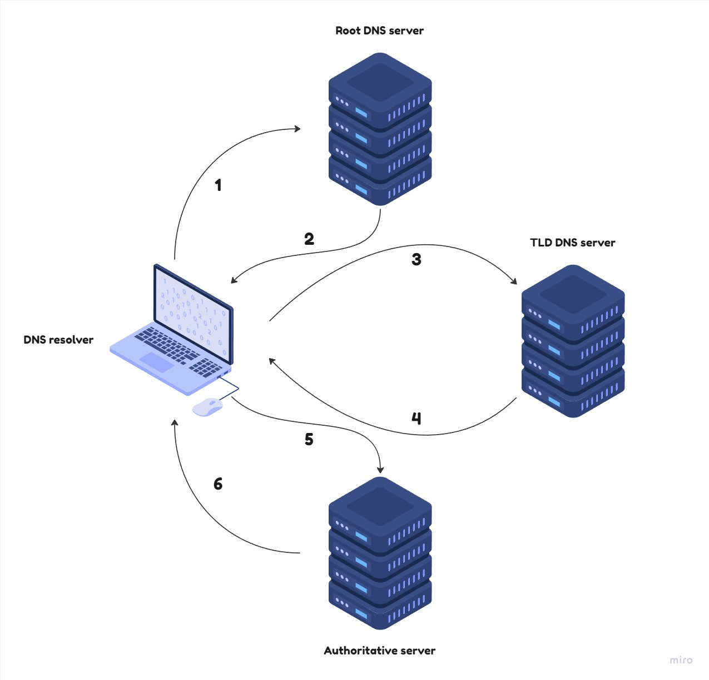

DNS Resolver
============
## Úvod
`DNS resolver` je lokálny agent, ktorý je zodpovedný za dotazovanie lokálnych/verejných DNS serverov a spracovávanie odpovedí za účelom prekladu doménových mien na IP adresy(aj inverzne) alebo získavaním iných informácií spojených s daným doménovým menom. Umožňuje tak užívateľom rýchlešiu a jednoduchšiu navigáciu na internete.<sup>[1]</sup>

DNS resolver pracuje s distribuovaným, hierarchickým, stromovým doménovým priestorom. Tento priestor je rozdelený na `zóny`. Najvyšší bod hierarchie je `root DNS server`, ktorý obsahuje informácie o serveroch najvyššej úrovni (TLD - Top Level Domain), ktoré sú zodpovedné za správu domén pod nimi. Každá doména najvyššej úrovne má svojho správcu, ktorý je zodpovedný za správu domén pod ňou. Tento proces sa opakuje až na úroveň `autoritatívnych DNS serverov`, ktoré vykonávajú mapovanie názvu domény na adresu pre doménu danej organizácie. Bližší popis dom0nov0ho priestoru možno nájsť na [tu](https://www.rfc-editor.org/rfc/rfc1034.txt).

Na základe metód vyhľadávania možno DNS resolvery rozdeliť:
- **Iteratívny DNS resolver** dotazuje reťazec DNS serverov v hierarchickej štruktúre doménového priestoru. Tento proces sa opakuje až kým resolver nedostane adresu autoritatívneho DNS servera pre danú doménu.



- **Ne-rekurzívny DNS resolver** dotazuje jeden DNS server, ktorý buď poskytne záznam z autoritatívneho serveru alebo čiastočnú odpoveď, bez toho, aby resolver pokračoval v dotazovaní ďalších DNS serverov.

- **Rekurzívny DNS resolver** dotazuje jeden DNS server, ktorý môže následne dotazovať ďalšie DNS servery. Tento proces na rozdiel od ne-rekurzívneho DNS resolveru poskytuje kompletné riešenie pre danú doménu. 


DNS Resolver si môže ukladať záznamy prekladov, ktoré vykonal. Tieto uložené záznamy potom slúžia pre rýchlešie vyhľadanie adresy pre daný názov domény. Ak resolver nemá v cache potrebné záznamy začína prekladanie od root DNS servera a postupne sa dostáva až k autoritatívnym DNS serverom pre danú doménu.

[1]: https://www.rfc-editor.org/rfc/rfc1035


## Preklad
```
g++ -std=c++11 -Wall -Wextra -pedantic -o dns dns.cpp
```